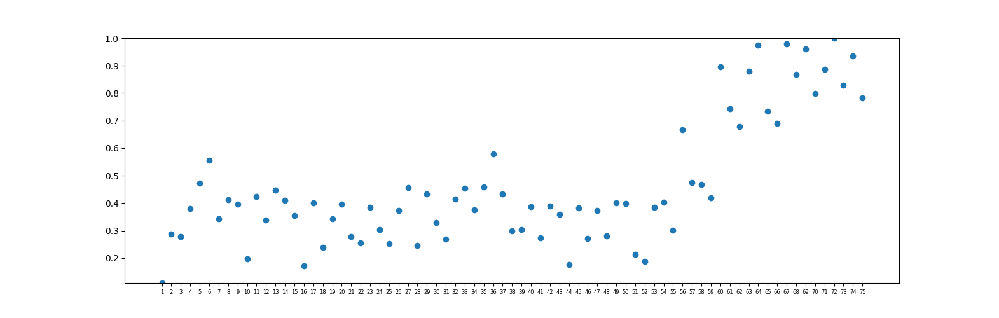

# midi_analyser
Python MIDI track classifier and tonal tension calculation based on spiral array theory
## Usage
1. **MIDI track separator**. Based on random forest classifier, it can find the melody, bass and harmony tracks in the MIDI file and output a new MIDI file with such tracks. If it cannot find bass or harmony tracks, it will only output a MIDI file if it detects a melody track.   **Example:**   track_separate.py -i _input_folder_ -o _output_folder_ 
input_folder contains the original midi files, and output_folder is the destination for the new MIDI file.

2. **Total tension and chord calculator**. It will output three tension metrics for the midi file and chord names for each half note. The tension metrics are based on the spiral array theory proposed in [1]. It includes cloud diameter, cloud momentum and tensile strain, which correspond with \_diameter, \_centroid_diff and \_total suffix in the output files. The tension calculation window could be set by parameter -w. -w 1 will set that to default value half note. -w 2 will double that window and each bar will output one tension value.  **Example:** tension_calculate.py -i _input_folder_ -o _output_folder_ -w 1 
The output also contains three graphs for the cloud diameter, cloud momentum and tensile strain.

In the example folder, new.mid is the result by running track_separate.py on the old.mid file. Then tension_calculate.py is called with -w 2 parameter. files_result.json records the file key and potential key changing bar position. \_chord_name file is the chord name for every half note. The output of tension, chord, chord name is in pickle format. Below is the figure of tensile strain of new.mid for every bar.

