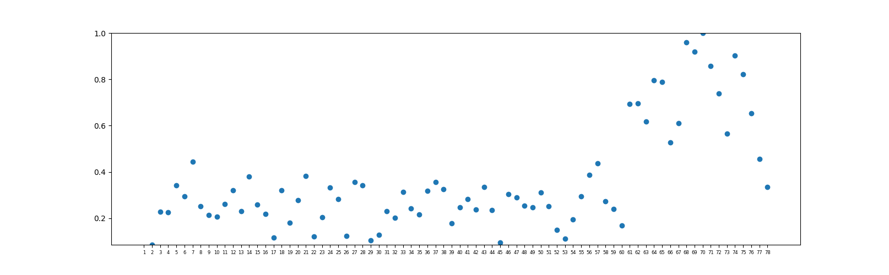
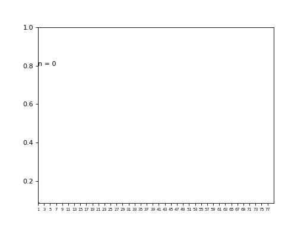

# Midi Miner
Python MIDI track classifier and tonal tension calculation based on spiral array theory
## Usage

1. **Total tension and chord calculator**. It will output three tension metrics for the midi file. The tension metrics are based on the spiral array theory proposed in [1], which includes cloud diameter, cloud momentum and tensile strain. The chord name for each half note window, key of the song and the key changing bar position of the song are also the result of calling tension_calculate.py.  The tension calculation length window could be set by parameter -w. -w 1 will set that to default value half note. -w 2 will double that window and each bar will output one tension value.  **Example:** tension_calculate.py -i _input_folder_ -o _output_folder_ -w 1 
This will run tension_calculate.py on all the file in the _input_folder_ and output the result in 
_output_folder_. -w 1 is to calcualte tension for every half note.
**Example:** tension_calculate.py -i _input_folder_ -o _output_folder_ -f abc.mid -w 2 
This will run tension_calculate.py on the file abc.mid in the _input_folder_ and output the result in 
_output_folder_. -w 2 is to calculate tension for every bar. 

In the example folder, 
tension_calculate.py -i input/ -o output/ -f abc.mid -w 2
will generate the tension files for abc.mid in the output folder.

files_result.json records the file key and potential key changing bar position. \_chord_name file is the chord name for every half note. The output of tension, chord, chord name is in pickle format. Below is the figure of tensile strain of abc.mid for every bar. 

2. **MIDI track separator**. Based on random forest classifier, it can find the melody, bass and harmony tracks in the MIDI file and output a new MIDI file with such tracks. If it cannot find bass or harmony tracks, it will only output a MIDI file if it detects a melody track.   **Example:**   track_separate.py -i _input_folder_ -o _output_folder_ 
input_folder contains the original midi files, and output_folder is the destination for the new MIDI file.
**Example:**   track_separate.py -i _input_folder_ -f abc.mid -o _output_folder_ 
This will only separate tracks in the file abc.mid. 
In the example/output folder, abc.mid is the result by running track_separate.py on the example/input/abc.mid file. 

The test_tension.ipynb file is the example to use some functions inside tension_calculate.py.

The classified midi files from the LMD-aligned dataset[2] contains 25938 files with at least three tracks including melody track. The dataset link https://drive.google.com/open?id=1ZuQC8qGUnasDVXERExFysCY_PoyTVcWJ  

[1] E. Chew. Mathematical and computational modeling of tonality. AMC, 10:12, 2014.

[2] Colin Raffel. "Learning-Based Methods for Comparing Sequences, with Applications to Audio-to-MIDI Alignment and Matching"

